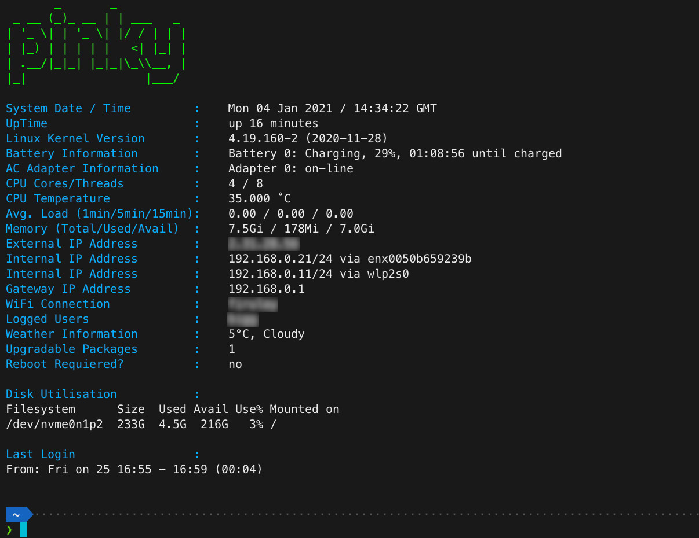

# debian.motd
===

It is my dynamic MOTD for Debian/Ubuntu.
You can find more details in my blog: [https://bigg.blog/](https://bigg.blog/)

# Usage:
If you are using Debian 10 already running `motd.service`, just place the file `10-bigg-debian.motd.sh` in `/etc/update-motd.d/` and make it executable, something like:
```
sudo mv 10-bigg-debian.motd.sh /etc/update-motd.d/10-bigg-debian.motd.sh
sudo chmod +x /etc/update-motd.d/10-bigg-debian.motd.sh
```

Now rename the file `/etc/motd`, something like:
```
sudo mv /etc/motd /etc/motd.old
```

# Requirement
There are some packages required to get details for Battery, AC Adapter and Temperature
### Install `acpi` for Battery and AC Adapter details
```
sudo apt install acpi
```

### Install `lm_sensors` for Temperature details
```
sudo apt install lm_sensors
```
then run the configuration/detection with:
```
sudo sensors-detect
```

# Screenshot

